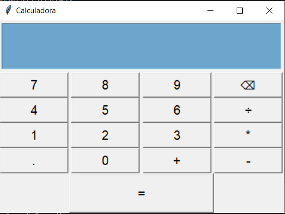

# Calculadora con interfaz grafica en Python
El objetivo de estos ejercicios es conocer el uso de la herremienta <a href="https://docs.python.org/3/library/tk.html">**tkinter**</a> en python, la cual nos permite hacer programas con interfaz grafica en para este lenguaje de programación.

## Calculadora

<pre><code>
from tkinter import Tk,Text,Button,END,re

class Interfaz:
    def __init__(self, ventana):
        #Inicializar la ventana con un título
        self.ventana=ventana
        self.ventana.title("Calculadora")

        #Agregar una caja de texto para que sea la pantalla de la calculadora
        self.pantalla=Text(ventana, state="disabled", width=40, height=3, background="SkyBlue3", foreground="white", font=("Helvetica",15))

        #Ubicar la pantalla en la ventana
        self.pantalla.grid(row=0, column=0, columnspan=4, padx=5, pady=5)

        #Inicializar la operación mostrada en pantalla como string vacío
        self.operacion=""

        #Crear los botones de la calculadora
        boton1=self.crearBoton(7)
        boton2=self.crearBoton(8)
        boton3=self.crearBoton(9)
        boton4=self.crearBoton(u"\u232B",escribir=False)
        boton5=self.crearBoton(4)
        boton6=self.crearBoton(5)
        boton7=self.crearBoton(6)
        boton8=self.crearBoton(u"\u00F7")
        boton9=self.crearBoton(1)
        boton10=self.crearBoton(2)
        boton11=self.crearBoton(3)
        boton12=self.crearBoton("*")
        boton13=self.crearBoton(".")
        boton14=self.crearBoton(0)
        boton15=self.crearBoton("+")
        boton16=self.crearBoton("-")
        boton17=self.crearBoton("=",escribir=False,ancho=20,alto=2)

        #Ubicar los botones con el gestor grid
        botones=[boton1, boton2, boton3, boton4, boton5, boton6, boton7, boton8, boton9, boton10, boton11, boton12, boton13, boton14, boton15, boton16, boton17]
        contador=0
        for fila in range(1,5):
            for columna in range(4):
                botones[contador].grid(row=fila,column=columna)
                contador+=1
        #Ubicar el último botón al final
        botones[16].grid(row=5,column=0,columnspan=4)
        
        return

    #Crea un botón mostrando el valor pasado por parámetro
    def crearBoton(self, valor, escribir=True, ancho=9, alto=1):
        return Button(self.ventana, text=valor, width=ancho, height=alto, font=("Helvetica",15), command=lambda:self.click(valor,escribir))

    #Controla el evento disparado al hacer click en un botón
    def click(self, texto, escribir):
        #Si el parámetro 'escribir' es True, entonces el parámetro texto debe mostrarse en pantalla. Si es False, no.
        if not escribir:
            #Sólo calcular si hay una operación a ser evaluada y si el usuario presionó '='
            if texto=="=" and self.operacion!="":
                #Reemplazar el valor unicode de la división por el operador división de Python '/'
                self.operacion=re.sub(u"\u00F7", "/", self.operacion)
                resultado=str(eval(self.operacion))
                self.operacion=""
                self.limpiarPantalla()
                self.mostrarEnPantalla(resultado)
            #Si se presionó el botón de borrado, limpiar la pantalla
            elif texto==u"\u232B":
                self.operacion=""
                self.limpiarPantalla()
        #Mostrar texto
        else:
            self.operacion+=str(texto)
            self.mostrarEnPantalla(texto)
        return
    

    #Borra el contenido de la pantalla de la calculadora
    def limpiarPantalla(self):
        self.pantalla.configure(state="normal")
        self.pantalla.delete("1.0", END)
        self.pantalla.configure(state="disabled")
        return
    

    #Muestra en la pantalla de la calculadora el contenido de las operaciones y los resultados
    def mostrarEnPantalla(self, valor):
        self.pantalla.configure(state="normal")
        self.pantalla.insert(END, valor)
        self.pantalla.configure(state="disabled")
        return

ventana_principal=Tk()
calculadora=Interfaz(ventana_principal)
ventana_principal.mainloop()
</code></pre>

<a href="https://github.com/ArturoEmmanuelToledoAguado/GrafPython2/blob/main/calSimple.py">Código</a>